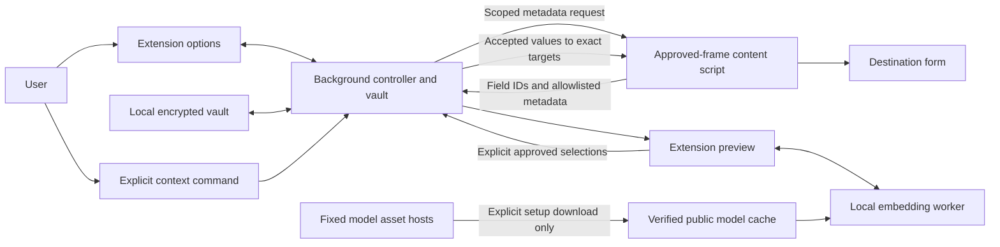

# Application design

AI Form Fill is a Firefox-first extension that keeps a personal profile in an
encrypted local vault, matches form fields on the device, and reveals values to
a website only after the user approves an extension-owned preview.

## User flow

1. **Set up:** Create an empty vault with a passphrase of at least 12 characters.
   Create groups, records, and attributes in the visual editor (or advanced JSON),
   then save encrypted changes. The education template includes school, country,
   city, state, study level, degree, GPA/scale, and class rank/size. Related records
   include first/second majors and minors, and start/end/graduation dates with
   separate month/year values and optional full ISO dates. Awards is a single
   freeform multiline text attribute on the degree. Duplicate a degree or major
   to add another; equal names and values remain separate. Existing
   plaintext profiles, backups, and alias caches are automatically erased before
   vault operations; restored old storage is erased again. There is no conversion.
2. **Prepare local matching:** Explicitly download the fixed quantized MiniLM
   embedding model. The download sends only public asset requests. Exact alias
   matching and manual selection also work without the model.
3. **Approve destinations:** Grant access to each site's exact origin, reload its
   page, and right-click an empty visible field. Third-party frames need their own
   permission and separate approval for each preview.
4. **Unlock:** The background derives a non-extractable encryption key and decrypts
   the profile into memory. Manual Lock, browser exit, or background eviction ends
   the session. Losing the passphrase means losing access to the vault.
5. **Preview:** Choose a field or form preview. Collect bounded metadata only from
   the selected frame and selected form, dialog, or semantic group. Assign a saved
   record to each destination section, and explicitly include its nested records.
   Match attribute names and aliases within that assignment first; a local worker
   computes normalized embeddings and cosine similarity for other candidates.
   Ambiguous exact matches or similarity matches less than 0.05 above the next
   attribute's score remain unapproved.
   Use manual sections and each field's section selector for unstructured layouts.
6. **Approve and fill:** Review destination, proposed values, and confidence.
   Select values, leave unwanted fields unchanged, and click Fill approved values.
   Revalidate the document and exact elements before inserting values. Optionally
   learn mappings for successful fills. Clipboard copying is a separate action.
7. **Manage:** Edit, change passphrase, exchange encrypted backups, revoke sites,
   remove the model, or clear all personal data.

### Repeated records and attributes

Each degree is a separate record, even when its school name equals another degree's
school name. Repeated majors can be separate attributes or nested records with their
own attributes. The preview displays paths and values to distinguish them. Select
one item for a field, assign different items to repeated page rows, or explicitly
combine selected values with a chosen nonempty separator. Nothing joins by default.
Changing a record assignment clears field choices and restarts matching.

The editor uses full background-colored cards: groups are blue, records green,
nested records alternate purple/green by depth, and attributes have their own
neutral surface. The first attribute is the highlighted **Main value**; **Additional
attributes** and **Related details** have separate headings and dividers. Each
record's name and controls remain inside its card. Aliases and duplicate/reorder/
delete actions are collapsed behind labeled disclosures. Attribute grids become
single-column on narrow screens; dark mode uses corresponding darker surfaces.
Single-value nested records omit empty additional-attribute and child-record
sections; add controls remain in a compact footer belonging to that record.
Container records with child records omit the empty main-value section.
Awards uses one full-width multiline text field under Additional attributes;
users type their awards in their own format. Its text, including line breaks,
is matched to awards/honors fields and inserted as one approved value.
Existing saved profiles retain their structure and values; the expanded template
is used when adding a new education group.

Split month/year dropdowns have independent aliases such as `startDateMonth` and
`startDateYear`, even when both controls share a visible label such as Start Date.
Exact matching checks name, ID, autocomplete, accessibility label, then associated
label, in that order. A collision within a metadata key remains unapproved.
Enter month names for dropdowns (their exact option values are resolved in the
preview), years as `YYYY`, and optional full dates as `YYYY-MM-DD`. Empty optional
template attributes are excluded from matching candidates. First/second majors
and minors have distinct ordinal aliases; repeated custom records remain supported.

Supported controls are empty visible text/email/tel/number/url/search inputs,
textareas, contenteditable elements, native selects/multiselects, dates, and months.
Dropdown matches require a unique enabled option value or label (exact first, then
normalized); the preview displays the actual option values to insert. Dates require
ISO `YYYY-MM-DD`, and months `YYYY-MM`. School or graduation-year values are not
silently converted to dates. Custom comboboxes, populated controls, passwords,
checkboxes, and radio buttons remain manual.

### Guided opening

Right-click a visible Add/Edit button, hash link, or ARIA button and choose
**Preview opening this Add/Edit control**. Inspect its destination and label in
the extension preview, then approve opening separately. Native submit buttons,
navigation links, and controls labeled with save/submit/delete/payment actions
are excluded. The page still controls what the approved click does; labels do
not prove a page handler is safe.

The content script consumes an opening token once, rechecks the exact control,
and observes DOM changes for up to ten seconds. It offers newly eligible fields
in inline groups or dialogs in that document/frame. Choose a scope if several
appear, prepare a fresh preview, assign a record, and approve insertion. Existing
eligible fields outside the revealed set are excluded. The observer disconnects
after discovery, timeout, cancellation, or document exit. Save or submit yourself;
another degree or major requires another explicit opening and preview. Opening
does not receive any profile values. New pages, tabs, and frames require a new
preview; unsupported or delayed layouts can be opened manually before previewing.

## Components and boundaries

**Background:** Owns the key, decrypted profile, serialized mutations, and short-lived
preview approvals. Only the extension's options and preview pages can access vault
operations. Each approval binds a request ID to a tab, frame, exact origin, document
token, field references, and vault epoch. Opening tokens and revealed scopes are
separate from fill approvals. Background insertion resolves attribute IDs, verifies
record/descendant membership, and derives the exact scalar or option values itself.
No automatic focus matching exists.

**Content script:** Runs only on permitted sites. Captures trusted context selection,
collects empty visible editable fields, and retains exact element references for
two minutes. It never receives a proposed value. It accepts only approved insertion
messages and checks document token, origin, metadata, form membership, and eligibility.
Untrusted HTML, current populated values, arbitrary attributes, and `data-*` are
excluded. Bounded section labels, control labels, control types, and dropdown option
labels/values are additional untrusted metadata; no saved value is used to discover
or open a subform. Options, section membership, and exact scope are rechecked before
insertion. No whole-document filling or cross-frame opening exists.

**Preview and worker:** The preview can display private values because it is an
extension page. The worker receives only field metadata, attribute names/aliases,
opaque attribute IDs, and candidate IDs constrained by the user's assignments. Record
display names, paths, and saved values are excluded. It uses the bundled
Transformers.js/ONNX JavaScript and WASM runtime on CPU;
model and runtime loading never fall back to a remote inference service.

## Storage and network

The versioned vault contains the entire structured profile, encrypted
with AES-256-GCM. PBKDF2-SHA-256 uses 600,000 iterations and a random 128-bit salt;
every write uses a fresh 96-bit IV. Passphrases and keys are never persisted or
synced. Site approvals and threshold settings are plaintext local preferences.
Plaintext JSON import/export is rejected; encrypted backup import authenticates
before replacement. Browser storage updates preserve the previous vault on failure.
The profile payload is version 2: `{version: 2, groups: [...]}`. Groups contain
`id`, `label`, and ordered `records`; records contain `id`, `label`, ordered
`attributes`, and nested `records`; attributes contain `id`, `label`, string `value`,
and `aliases`. Generated IDs are UUIDs; imported IDs must be unique bounded strings.
Validation permits at most eight record levels, 1,000 attributes, 2,000 total nodes,
20,000 characters per value, 100 aliases per attribute, 256 characters per label or
alias, and 1,000,000 serialized characters. Empty draft attributes are allowed but
never proposed for insertion. Visual and JSON views share the same draft and validator.

The encryption envelope stays version 1. Authenticated flat encrypted profiles
convert into an Ungrouped record in memory, retaining the original stored envelope
until an explicit save or replacement operation. A lone Ungrouped record is assigned
by default to retain the flat-profile workflow. Structured records otherwise require
explicit assignment. Converted backup imports authenticate before re-encryption.
Migration does not recover or import obsolete plaintext storage.
Manual preview cancellation interrupts opening immediately; revocation and
clear-all invalidate active page work before queued storage mutations proceed.

Background startup clears obsolete sync/session storage and removes old local
profile keys without reading their contents. Cleanup preserves the encrypted vault,
preferences, and public model cache. A cleanup failure blocks vault operations
until a retry succeeds; storage changes trigger cleanup if old data returns.

Public model assets are revision-pinned and checked against exact sizes and SHA-256
hashes during download and loading. Only setup downloads contact Hugging Face and
the fixed asset hosts; requests omit credentials and referrers. Inference reads
extension-owned cache entries. CSP restricts executable code to packaged resources
and external connections to model asset hosts. No analytics or AI server exists.

## Failures and limits

Navigation, locking, permission revocation, expired requests, and changed targets
prevent stale insertion. Populated or ineligible fields are skipped. Missing or
corrupt models leave exact matching and manual selection available. Diagnostics
contain fixed error codes rather than private values or request bodies.
Collection is bounded to 200 fields and 200 options per dropdown; oversized native
dropdowns remain manual. Guided discovery offers at most 20 scopes. A subform that
relies on a trusted click, custom widget interaction, or later steps may need manual
opening. The extension never automatically saves, submits, or loops through records.
Model batches support at most 2,000 distinct attribute names/aliases; exact matching
and manual selection remain available when that model limit is exceeded.

Clear-all removes extension storage across local/sync/session areas, model caches,
and decrypted background/UI state. It cannot erase earlier downloads, clipboard
history, other synced devices, or browser/profile backups. Encryption protects the
stored profile; it cannot protect an unlocked browser from compromise. JavaScript
memory disposal is logical cleanup rather than guaranteed forensic zeroization.
Once approved values enter a field, the destination and its scripts can read them.
