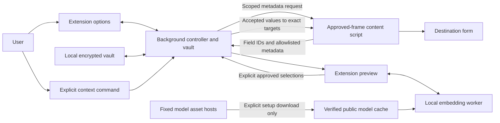

# Application design

AI Form Fill is a Firefox-first extension that keeps a personal profile in an
encrypted local vault, matches form fields on the device, and reveals values to
a website only after the user approves an extension-owned preview.

## User flow

1. **Set up:** Create an empty vault with a passphrase of at least 12 characters.
   Enter values and their field aliases, then save encrypted changes. Existing
   plaintext profiles, backups, and alias caches are automatically erased before
   vault operations; restored old storage is erased again. There is no conversion.
2. **Prepare local matching:** Explicitly download the fixed quantized MiniLM
   embedding model. The download sends only public asset requests. Exact alias
   matching and manual selection also work without the model.
3. **Approve destinations:** Grant access to each site's exact origin, reload its
   page, and right-click an empty visible field. Third-party frames need their own
   permission and separate approval for each preview.
4. **Unlock:** The background derives a non-extractable encryption key and decrypts
   the profile into memory. Manual Lock, browser exit, or background eviction ends
   the session. Losing the passphrase means losing access to the vault.
5. **Preview:** Choose a field or form preview. Collect bounded metadata only from
   the selected frame and selected form. Match exact aliases first; a local worker
   computes normalized embeddings and cosine similarity for other candidates.
6. **Approve and fill:** Review destination, proposed values, and confidence.
   Select values, leave unwanted fields unchanged, and click Fill approved values.
   Revalidate the document and exact elements before inserting values. Optionally
   learn mappings for successful fills. Clipboard copying is a separate action.
7. **Manage:** Edit, change passphrase, exchange encrypted backups, revoke sites,
   remove the model, or clear all personal data.

## Components and boundaries

**Background:** Owns the key, decrypted profile, serialized mutations, and short-lived
preview approvals. Only the extension's options and preview pages can access vault
operations. Each approval binds a request ID to a tab, frame, exact origin, document
token, field references, and vault epoch. No automatic focus matching exists.

**Content script:** Runs only on permitted sites. Captures trusted context selection,
collects empty visible editable fields, and retains exact element references for
two minutes. It never receives a proposed value. It accepts only approved insertion
messages and checks document token, origin, metadata, form membership, and eligibility.
Untrusted HTML, current values, arbitrary attributes, and `data-*` are excluded.

**Preview and worker:** The preview can display private values because it is an
extension page. The worker receives only field metadata, aliases, and opaque entry
IDs. It uses the bundled Transformers.js/ONNX JavaScript and WASM runtime on CPU;
model and runtime loading never fall back to a remote inference service.

## Storage and network

The versioned vault contains the entire values-and-aliases dictionary, encrypted
with AES-256-GCM. PBKDF2-SHA-256 uses 600,000 iterations and a random 128-bit salt;
every write uses a fresh 96-bit IV. Passphrases and keys are never persisted or
synced. Site approvals and threshold settings are plaintext local preferences.
Plaintext JSON import/export is rejected; encrypted backup import authenticates
before replacement. Browser storage updates preserve the previous vault on failure.
Background startup clears obsolete sync/session storage and removes old local
profile keys without reading their contents. Cleanup preserves the encrypted vault,
preferences, and public model cache. A cleanup failure blocks vault operations
until a retry succeeds; storage changes trigger cleanup if old data returns.

Public model assets are revision-pinned and checked against exact sizes and SHA-256
hashes during download and loading. Only setup downloads contact Hugging Face and
the fixed asset hosts; requests omit credentials and referrers. Inference reads
extension-owned cache entries. CSP restricts executable code to packaged resources
and external connections to model asset hosts. No analytics or AI server exists.

## Failures and limits

Navigation, locking, permission revocation, expired requests, and changed targets
prevent stale insertion. Populated or ineligible fields are skipped. Missing or
corrupt models leave exact matching and manual selection available. Diagnostics
contain fixed error codes rather than private values or request bodies.

Clear-all removes extension storage across local/sync/session areas, model caches,
and decrypted background/UI state. It cannot erase earlier downloads, clipboard
history, other synced devices, or browser/profile backups. Encryption protects the
stored profile; it cannot protect an unlocked browser from compromise. JavaScript
memory disposal is logical cleanup rather than guaranteed forensic zeroization.
Once approved values enter a field, the destination and its scripts can read them.
